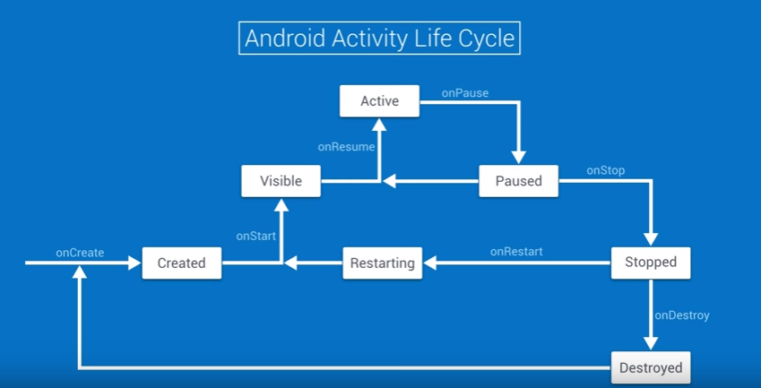

# Lifecycle

Os métodos, estados que compõem o ciclo de vida de uma Activity são:
- onCreate()
	- Quando o sistema cria a Activity
	- Evento ON_CREATE
- onStart()
	- Sistema torna a Activity visível para o usuário
	- Muito rápido
	- Evento ON_START
- onResume()
	- Estado em que o usuário interage diretamente com a Activity
	- O app mantém nesse estado até que algo interrompa, por exemplo, abre 
	outra activity, app crash, etc.
	- Evento ON_RESUME
- onPause()
	- Chamado quando o usuário sai da Activity
	- Pode ser usado para gerenciar alguns recursos do sistema
	- Ao sair do onPause() volta para onResume()
	- Evento ON_PAUSE
- onStop()
	- Quando a Activity não está mais disponível para o usuário
	- Evento ON_STOP
- onDestroy()
	- Quando finaliza a Activity
	- Evento ON_DESTROY




Você pode salvar alguns dados usando o método ``onSaveInstance()`` e 
recuperar com ``onRestoreInstanceState()``

```kotlin
override fun onSaveInstanceState(outState: Bundle?) {
    // Save the user's current game state
    outState?.run {
        putInt(STATE_SCORE, currentScore)
        putInt(STATE_LEVEL, currentLevel)
    }

    // Always call the superclass so it can save the view hierarchy state
    super.onSaveInstanceState(outState)
}

companion object {
    val STATE_SCORE = "playerScore"
    val STATE_LEVEL = "playerLevel"
}
```

```kotlin
override fun onCreate(savedInstanceState: Bundle?) {
    super.onCreate(savedInstanceState) // Always call the superclass first

    // Check whether we're recreating a previously destroyed instance
    if (savedInstanceState != null) {
        with(savedInstanceState) {
            // Restore value of members from saved state
            currentScore = getInt(STATE_SCORE)
            currentLevel = getInt(STATE_LEVEL)
        }
    } else {
        // Probably initialize members with default values for a new 
instance
    }
    // ...
}
```
