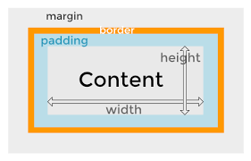

# Interfaces no Android

No android, os layouts são compostos atravéz de arquivos xml
localizados na pasta ``res/layout/filename.xml``

## Views

### TextView
```xml
<TextView
android:layout_width="match_parent"
android:layout_height="wrap_content"
android:text="Texto"
android:textSize="24sp"/>
```
É importante usar a medida ``sp`` pois o tamanho da letra é dinamicamente 
ajustado conforme as preferências do usuário.  

### ImageView
```xml
<ImageView
android:layout_width="200dp"
android:layout_height="200dp"
android:src="/image.png"
android:scaleType="centerCrop"
android:contentDescription="Descrição da imagem"/>
```
É importante usar o atributo contentDescrition para descrever a imagem 
para o app ser mais acessível

Obs: colocar strings em ``strings.xml`` localizado em ``res/values/``

## Group View

### LinearLayout
As views são organizadas horizontalmente ou verticalmente

```xml
<LinearLayout xmlns:android="http://schemas.android.com/apk/res/android"
    android:layout_width="match_parent"
    android:layout_height="match_parent"
    android:paddingLeft="16dp"
    android:paddingRight="16dp"
    android:orientation="vertical" >
    <EditText
        android:layout_width="match_parent"
        android:layout_height="wrap_content"
        android:hint="@string/to" />
    <EditText
        android:layout_width="match_parent"
        android:layout_height="wrap_content"
        android:hint="@string/subject" />
    <EditText
        android:layout_width="match_parent"
        android:layout_height="0dp"
        android:layout_weight="1"
        android:gravity="top"
        android:hint="@string/message" />
    <Button
        android:layout_width="100dp"
        android:layout_height="wrap_content"
        android:layout_gravity="right"
        android:text="@string/send" />
</LinearLayout>
```

#### Weight
Pode ser usado ``weight`` ou ``android:layout_weight`` para 
espçar os elementos de forma proporcional.

Normalmente usa-se ``layout_width="0"`` ou ``layout_height="0"``, 
dependendo da orientação do LinearLayout, porém isso é opcional.

```xml
<LinearLayout
     android:layout_width="fill_parent"
     android:layout_height="wrap_content"
     android:orientation="horizontal">

     <Button
        android:text="Register"
        android:id="@+id/register"
        android:layout_width="wrap_content"
        android:layout_height="wrap_content"
        android:padding="10dip"
        weight="1" />

     <Button
        android:text="Not this time"
        android:id="@+id/cancel"
        android:layout_width="wrap_content"
        android:layout_height="wrap_content"
        android:padding="10dip"
        weight="1" />

  </LinearLayout>
```

Os dois botões serão espaçados igualmente 50%  50%

### RelativeLayout

As views são posicionadas em relação a outra view ou em relação ao 
pai(parent)

```xml
<?xml version="1.0" encoding="utf-8"?>
<RelativeLayout xmlns:android="http://schemas.android.com/apk/res/android"
    android:layout_width="match_parent"
    android:layout_height="match_parent"
    android:paddingLeft="16dp"
    android:paddingRight="16dp" >
    <EditText
        android:id="@+id/name"
        android:layout_width="match_parent"
        android:layout_height="wrap_content"
        android:hint="@string/reminder" />
    <Spinner
        android:id="@+id/dates"
        android:layout_width="0dp"
        android:layout_height="wrap_content"
        android:layout_below="@id/name"
        android:layout_alignParentLeft="true"
        android:layout_toLeftOf="@+id/times" />
    <Spinner
        android:id="@id/times"
        android:layout_width="96dp"
        android:layout_height="wrap_content"
        android:layout_below="@id/name"
        android:layout_alignParentRight="true" />
    <Button
        android:layout_width="96dp"
        android:layout_height="wrap_content"
        android:layout_below="@id/times"
        android:layout_alignParentRight="true"
        android:text="@string/done" />
</RelativeLayout>
```

``android:id="@+id/id_da_view`` é usado quando é criado um novo id.

``android:id="@id/id_da_view`` é usado para referenciar um id já criado.

## Padding vs Margin

Pode ser usado no arquivo de layout, os atributos ``android:padding`` e 
``android:layout_margin`` para espaçar as views. 

A diferença é que **padding** está contido na view, e **margin** não está 
contido, é um espaçamento para fora da view.



## Style

Para facilitar a estilização das views, pode ser usado a resource 
``style.xml`` em ``res/values/``

```xml
<?xml version="1.0" encoding="utf-8"?>
<resources>
    <style name="CustomText" parent="@style/Text">
        <item name="android:textSize">20sp</item>
        <item name="android:textColor">#008</item>
    </style>
</resources>
```
Você pode usar um style já pronto dentro de um style usando o atributo 
``parent``.

Usando style:
```xml
<ImageView
android:layout_width="200dp"
android:layout_height="wrap_content"
android:text="Hello World"
android:style="@style/CustomText"/>
```

## Themes
É o mesmo conceito de Style, mas é aplicado para seu app ou activity 
inteira. Para aplicar deve colocar no arquivo ``AndroidManifest.xml``

Aplicando no app:
```xml
<manifest ... >
    <application android:theme="@style/Theme.AppCompat" ... >
    </application>
</manifest>
```

Aplicando na Activity:
```xml
<manifest ... >
    <application ... >
        <activity android:theme="@style/Theme.AppCompat.Light" ... >
        </activity>
    </application>
</manifest>
```
