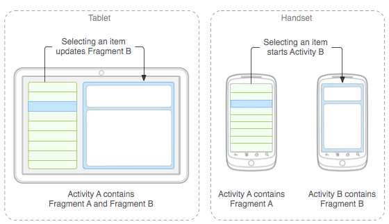

# Fragments

**Fragments** são fragmentos de uma interface que podem ser combinados para compor um 
layout de uma activity, também podem ser reutilizados em outras activities.

Um exemplo de como um fragment pode ser usado pode ser observado na imagem abaixo:



Você pode ver mais detalhes na [documentação oficial do Android](https://developer.android.com/guide/components/fragments).

Para criar um fragment precisamos criar uma classe que extende ``Fragments()`` , da seguinte forma:

```kotlin
class ExampleFragment : Fragment() {

    override fun onCreateView(
            inflater: LayoutInflater,
            container: ViewGroup?,
            savedInstanceState: Bundle?
    ): View {
        // Inflate the layout for this fragment
        return inflater.inflate(R.layout.example_fragment, container, false)
    }
}
```

E um arquivo do layout do fragment, da mesma forma que é feita com activities.

No exemplo acima esse arquivo é chamado ``example_fragment.xml``.

Para usar o fragments precisamos de alguma view onde o fragment será exibido.
Podemos especificar os fragments no layout da seguinte forma:

```xml
<?xml version="1.0" encoding="utf-8"?>
<LinearLayout xmlns:android="http://schemas.android.com/apk/res/android"
    android:orientation="horizontal"
    android:layout_width="match_parent"
    android:layout_height="match_parent">
    <fragment android:name="com.example.news.ArticleListFragment"
            android:id="@+id/list"
            android:layout_weight="1"
            android:layout_width="0dp"
            android:layout_height="match_parent" />
    <fragment android:name="com.example.news.ArticleReaderFragment"
            android:id="@+id/viewer"
            android:layout_weight="2"
            android:layout_width="0dp"
            android:layout_height="match_parent" />
</LinearLayout>
```

E basta inflar o fragment na activity:

```kotlin
val fragment = ExampleFragment()
fragmentTransaction.add(R.id.fragment_container, fragment)
fragmentTransaction.commit()
```

Observe que especificamos a view a qual o fragment será inserido.


